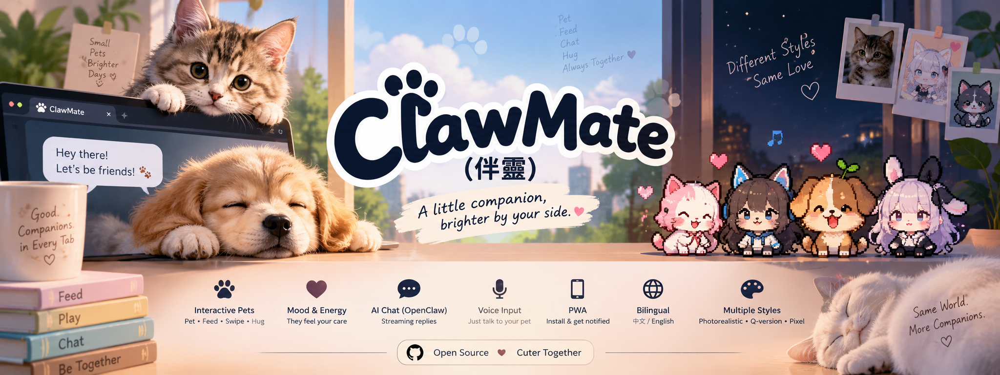
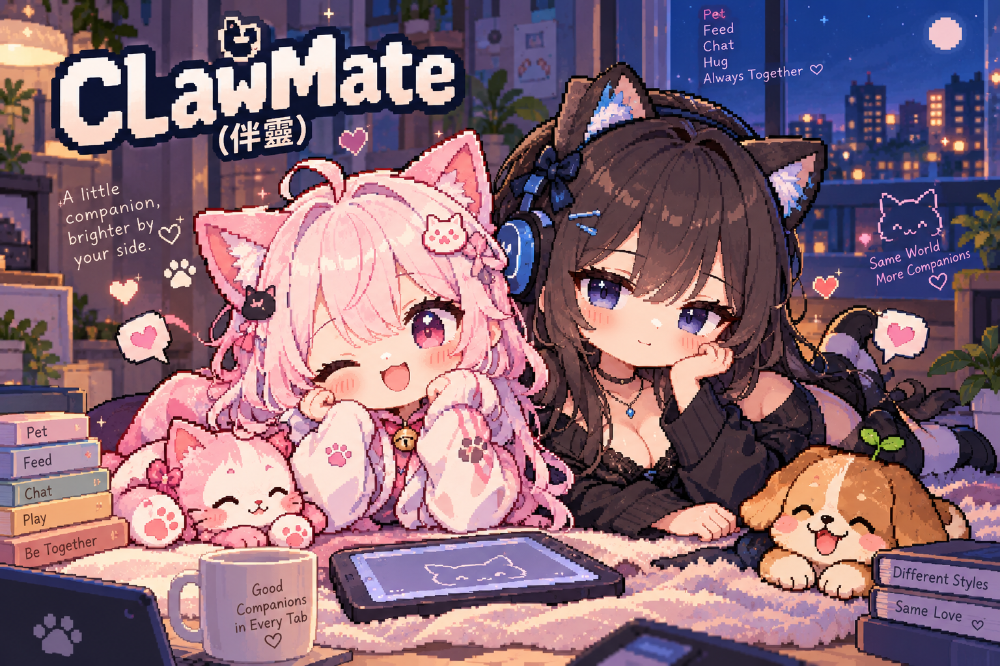

<p align="center">
  
</p>
# ClawMate (伴靈)

A web-based digital pet you keep as a browser tab or install as a PWA. Pet it, feed it,
swipe and hug it — and chat with it through your own [OpenClaw](https://github.com/openclaw)
agent, with streaming replies and optional push notifications.

<p>
  
  
  
  
</p>

## Features

- Photorealistic HD pets, detailed species-specific Q-version art, and pixel-art character styles with touch interactions (tap, swipe, long-press)
- Mood/energy stats that react to how you play with the pet
- AI chat over an OpenClaw Gateway, via either transport:
  - **OpenAI-compatible** (`/v1/chat/completions`, SSE streaming) — recommended, most reliable
  - **Gateway WebSocket** (native OpenClaw protocol v4)
- Voice input (Web Speech API) and an in-chat "start new session" button to reset context
- Installable PWA with offline shell caching and web push notifications
- Bilingual UI (Traditional Chinese / English), light/dark/auto theme
- Runs as a plain Node process or via Docker

Pixel mode uses a JavaScript articulated model for Momo, Aria, Mochi and Coco.
It redraws geometry on a 128 × 164 Canvas pixel grid at 16 frames per second;
the original PNGs are visual references, not animation layers. A single tap
immediately chooses a wave, dance, hop, stretch, bow or kick without consecutive
repeats. Reduced motion keeps facial reactions but disables body animation.
Animation pauses when the page is hidden and is disposed when changing styles
or characters. Character cards use a static SVG from the same model.

Run the pixel rendering, gesture and lifecycle checks with
`npm test`.

## Quick start

```bash
npm install
./start.sh          # native Node server: http://localhost:2050
./stop.sh
```

To use a different native port, prefix the command with `PORT=8080` (or put
`PORT=8080` in `.env`). Docker uses port `8080` by default; see [Docker](#docker).
For a minimal direct run without the helper script, `npm start` listens on port `8080`.

### Tailscale Serve under a path

ClawMate detects its URL prefix automatically, so it can be mounted below a
shared Tailscale Serve hostname. For the default port used by `start.sh`:

```bash
tailscale serve --bg --https=443 --set-path=/clawmate http://127.0.0.1:2050
```

Open the exact URL with its trailing slash:
`https://<machine>.<tailnet>.ts.net/clawmate/`. API, WebSocket, PWA, and push
notification URLs will all remain under `/clawmate/`.

`start.sh` is idempotent — it stops any previous instance of the app (matched by command
and working directory) before starting a fresh one, and waits for `/api/health` before
reporting success. Logs go to `logs/app.log`, the PID to `.pid`.

### Docker

```bash
./start.sh --docker      # or: docker compose up -d --build
./stop.sh --docker
```

Optionally run OpenClaw itself alongside the app:

```bash
docker compose --profile openclaw up -d
```

then point the app's Settings screen at `http://openclaw:18789`.

## Device pairing

ClawMate's own HTTP/WebSocket endpoints have no login of their own, and the server
listens on `0.0.0.0` - so without pairing, anyone on the same LAN who can reach the
port could chat through your configured OpenClaw token once it's been entered.

Instead, every browser generates its own random device id (via `crypto.randomUUID()`,
stored in `localStorage`) and sends it with every request. The id is never derived
from request metadata like the User-Agent, so it can't be forged by spoofing that
metadata - only guessing it works, which is infeasible. A brand-new device sees a
"not paired" screen showing its id and stays locked out of the API and chat socket
until you approve it from the host's terminal:

```bash
./start.sh approve <device-id>   # let a device through
./start.sh devices               # list every device that has ever connected
./start.sh revoke <device-id>    # pull a device's access back
```

Pairing state lives in `data/devices.json`, next to the rest of ClawMate's data.

## Configuring the OpenClaw connection

Everything can be configured from the in-app **Settings** tab — no restart needed:

- **OpenClaw URL** — where your Gateway lives, e.g. `http://localhost:18789`
- **Token** — the Gateway token (kept server-side only, never sent to the browser)
- **Agent ID** — auto-populated from your OpenClaw instance
- **Transport** — OpenAI-compatible (recommended) or Gateway WebSocket

Use **Test connection** to probe the server; it auto-recommends the transport your
OpenClaw build actually supports.

Alternatively, seed the initial config via environment variables (see [`.env.example`](.env.example)):
`PORT`, `DATA_DIR`, `OPENCLAW_URL`, `OPENCLAW_TOKEN`, `OPENCLAW_AGENT_ID`, and the
`VAPID_*` keys for push notifications. Settings saved through the UI are persisted to
`data/settings.json` and take precedence over env vars after first boot.

Every request ClawMate sends to OpenClaw identifies itself with the client name
`ClawMate` (WebSocket handshake `client.id` and a `User-Agent` header on HTTP calls), so
it's recognizable in OpenClaw's own connection/session views.

## Starting a new chat session

Each chat message is tied to a session key (`agent:<agentId>:<sessionId>`) so OpenClaw
can keep conversation context. The **new session** button in the chat view (top-right,
"+" icon) rotates to a fresh `sessionId` and drops a divider into the chat log, so the
agent starts without carrying over prior context - but, like Telegram, earlier messages
stay visible above the divider instead of being erased. The full chat log also persists
in the browser's `localStorage`, so a page refresh does not wipe the conversation.

## Project layout

```
server/           Express + WebSocket backend
  index.js          HTTP routes, WebSocket relay, push notifications
  openclaw.js        OpenClaw transport adapters (OpenAI-compatible + Gateway WS)
  config.js          Settings persistence (data/settings.json)
  devices.js         Device pairing registry + `approve`/`revoke`/`list` CLI
  push.js            Web push subscription handling
public/           Static PWA frontend
  index.html
  js/                App logic, chat UI, settings, i18n, pet rendering/interactions, device.js
  css/app.css
  sw.js              Service worker (offline shell + push)
data/             Persisted settings, paired devices, and VAPID keys (created on first run)
```

## Requirements

- Node.js >= 20
- An OpenClaw Gateway reachable from wherever ClawMate runs

## Notes for contributors

- Run the pixel renderer and gesture checks with `npm test`.
- `data/` contains runtime state and credentials; do not commit a populated `data/settings.json` or VAPID private key.

## License

Distributed under the [MIT License](LICENSE).

<p align="center">
  
</p>
